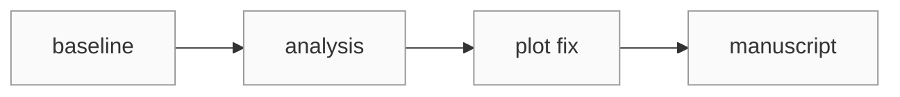

# 1. Why Git in research?

---

# The problem Git solves

  

    
🧪

    <h3 class="font-700 mt-3">Experiments change</h3>
    
You try an idea, change parameters, fix a bug, and eventually wonder what worked.

  

  

    
👥

    <h3 class="font-700 mt-3">People change files</h3>
    
You collaborate with a supervisor, co-author, or lab mate without emailing copies around.

  

  

    
📚

    <h3 class="font-700 mt-3">Research changes over time</h3>
    
You want to answer: “What changed between the result in March and the result in June?”

  

---

# Git is a timeline for your project

Git records snapshots of files as commits.

  commit 1 · baseline
  commit 2 · add analysis
  commit 3 · fix plot
  commit 4 · manuscript edits

---

# Git ≠ GitHub

<h3 class="text-xl font-700">Git</h3>

The version-control system on your computer.

Tracks files, commits, branches, merges, history.

<h3 class="text-xl font-700">GitHub</h3>

A web platform where Git repositories can be hosted and collaborated on.

Pull requests, reviews, issues, permissions, releases.

You can use Git without GitHub. You can also use GitHub without knowing every Git command.

