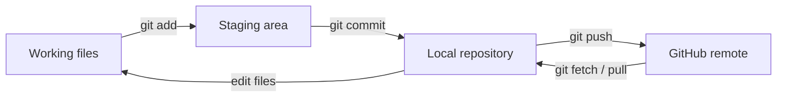

# 2. The mental model

---

# Four places to keep straight



<div class="grid grid-cols-4 gap-3 mt-5 text-xs">
  <div class="command-card"><b>Working tree</b><br/>Files you are editing now</div>
  <div class="command-card"><b>Staging area</b><br/>What will go into the next commit</div>
  <div class="command-card"><b>Local repo</b><br/>Your local history</div>
  <div class="command-card"><b>Remote</b><br/>Usually GitHub</div>
</div>

---

# First setup: tell Git who you are

```bash
git --version

git config --global user.name "Your Name"
git config --global user.email "you@example.org"
```

Check the configuration:

```bash
git config --global --list
```

<div class="mt-5 text-sm muted">Do this once per computer. Your Git commits record this author identity.</div>

---

# Starting from an existing GitHub repository

```bash
git clone https://github.com/your-lab/project.git
cd project
```

Typical first checks:

```bash
git status
git branch -a
git remote -v
```

<div class="mt-5 text-sm muted">For an existing lab repository, <code>clone</code> is usually the starting point.</div>

---

# Starting a new research project

```bash
mkdir thesis-analysis
cd thesis-analysis

git init
```

Then create your first file:

```bash
echo "# Thesis analysis" > README.md

git add README.md
git commit -m "Start thesis analysis project"
```

<div class="mt-5 text-sm muted">Later, connect this local repository to a GitHub remote with <code>git remote add</code> and push it.</div>

---

# The command you should learn first: status

```bash
git status
```

It answers questions like:

- Which branch am I on?
- Which files changed?
- Which files are staged?
- Is my branch ahead of or behind the remote?

<div class="mt-6 text-lg">When unsure what is happening, start with <code>git status</code>.</div>

---

# See exactly what changed

Unstaged changes:

```bash
git diff
```

Changes that are already staged:

```bash
git diff --staged
```

History:

```bash
git log --oneline --decorate --graph --all
```

<div class="mt-6 text-sm muted">A good habit: inspect the diff before you commit.</div>

---

# The everyday loop

```text
EDIT → STATUS → DIFF → ADD → COMMIT
  ↑                         ↓
  └──────────── repeat ─────┘
```

Example:

```bash
vim analysis.py

git status
git diff

git add analysis.py
git diff --staged
git commit -m "Add baseline analysis"
```

<div class="mt-5 text-sm muted">A commit is a named checkpoint, not “send to GitHub”.</div>

---

# What makes a useful commit?

A good commit answers: **what changed, and why?**

```bash
git commit -m "Fix uncertainty calculation"
```

Less useful:

```bash
git commit -m "stuff"
```

For research, smaller commits make it easier to:

- understand the history
- review changes
- find where a result changed
- revert a bad change
