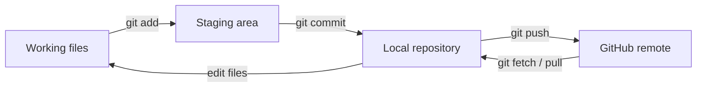

# Four places to keep straight



<div class="grid grid-cols-4 gap-3 mt-5 text-xs">
  <div v-click class="command-card"><b>Working tree</b><br/>Files you are editing now</div>
  <div v-click class="command-card"><b>Staging area</b><br/>What goes into the next commit</div>
  <div v-click class="command-card"><b>Local repo</b><br/>Your local history</div>
  <div v-click class="command-card"><b>Remote</b><br/>Usually GitHub</div>
</div>

<div v-click class="mt-6 text-lg">A commit is a named checkpoint, not “send to GitHub”.</div>

<!--
~1:00. Walk the arrows left to right while revealing the cards.
-->

---

# The everyday loop

<div class="grid grid-cols-2 gap-8 mt-4 text-left items-start">
<div>

```bash {1|2|3|4|all}
git status
git diff
git add analysis.py
git commit -m "Fix uncertainty calculation"
```

</div>
<div class="text-lg">

<v-clicks>

- `status`: what changed?
- `diff`: exactly what changed?
- `add`: choose it for the next commit
- `commit`: save a named checkpoint

</v-clicks>

</div>
</div>

<div v-click class="mt-6">
  A good message says <b>what and why</b>: “Fix uncertainty calculation”, not “stuff”. Small commits are easier to review and revert.
</div>

<div v-click class="mt-4 text-sm muted">
  First time on a computer: <code>git config --global user.name "Your Name"</code> and <code>user.email "you@example.org"</code>. New project: <code>git init</code>; existing one: <code>git clone URL</code>.
</div>

<!--
~1:15. Live demo possible here. When unsure what is happening, run git status.
-->
