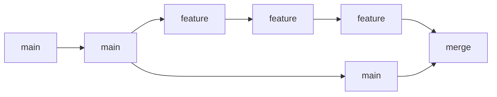
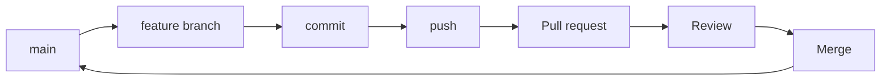

# 3. Branches and collaboration

---

# A branch is just a named line of work



Examples of branch names:

```text
feature/new-figure
fix/normalisation
paper/discussion
analysis/bootstrap
```

---

# Create a branch and switch to it

```bash
git switch -c feature/new-figure
```

Check where you are:

```bash
git branch --show-current
```

Switch back:

```bash
git switch main
```

<div class="mt-5 text-sm muted">Modern Git provides <code>switch</code> specifically for branch switching.</div>

---

# A practical PhD workflow

<div class="grid grid-cols-2 gap-8 mt-8 text-left">
<div>

### 1 · Start clean

```bash
git switch main
git pull --ff-only
```

### 2 · Create focused work

```bash
git switch -c fix/plot-labels
```

</div>
<div>

### 3 · Save checkpoints

```bash
git add figures/
git commit -m "Fix plot labels"
```

### 4 · Share the branch

```bash
git push -u origin fix/plot-labels
```

</div>
</div>

---

# Fetch, pull, push — three different jobs

| Command | Mental model |
|---|---|
| `git fetch` | “Tell me what changed on the remote.” |
| `git pull` | “Fetch those changes and integrate them into my current branch.” |
| `git push` | “Send my local commits to the remote.” |

A safe inspection step:

```bash
git fetch
git status
```

<div class="mt-4 text-sm muted">Be especially careful with <code>pull</code> when your working tree already contains uncommitted changes.</div>

---

# From branch to pull request



A pull request is a **proposal to merge changes**, with a place for discussion and review.

---

# What to put in a pull request

**Title**

> Fix uncertainty calculation in Figure 3

**Description**

- What changed?
- Why did you change it?
- How did you test it?
- Is there anything reviewers should look at carefully?

For research, it can also help to link the PR to a paper section, issue, analysis question, or meeting note.

---

# Keep your branch up to date

Before starting a new task:

```bash
git switch main
git pull --ff-only
git switch -c feature/new-analysis
```

If your branch lives for longer:

```bash
git fetch origin
git switch feature/new-analysis
git merge origin/main
```

<div class="mt-5 text-sm muted">There are multiple valid team policies for updating branches. The important part is to know which integration strategy your lab uses.</div>
